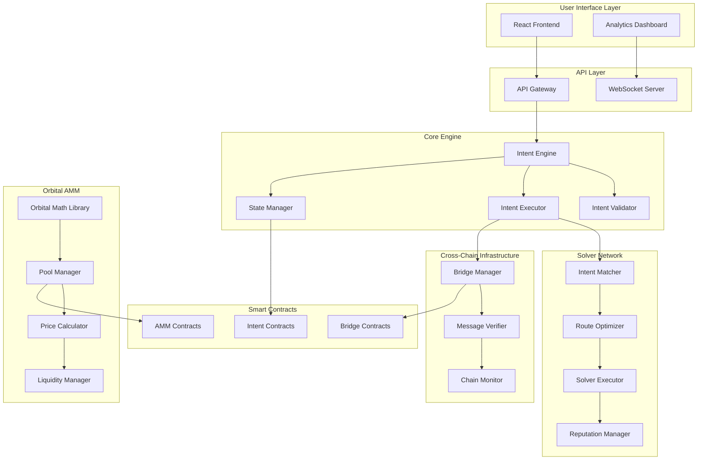

# Cross-Chain Orbital Intents AMM - System Architecture Design
*Generated by System Architect Agent*

## Executive Summary

The Cross-Chain Orbital Intents AMM is a sophisticated decentralized finance (DeFi) system that combines intent-based architecture with orbital AMM mechanics for efficient cross-chain asset exchange. This document provides a comprehensive architectural analysis, design patterns, and implementation roadmap.

## 1. Current Architecture Analysis

### 1.1 High-Level System Overview

```
┌─────────────────────────────────────────────────────────────────┐
│                    Cross-Chain Orbital Intents AMM              │
├─────────────────────────────────────────────────────────────────┤
│  Frontend Layer    │ React UI │ Web3 Integration │ Analytics   │
├─────────────────────────────────────────────────────────────────┤
│  API Gateway       │ REST/WS  │ Rate Limiting    │ Auth        │
├─────────────────────────────────────────────────────────────────┤
│  Intent Engine     │ Validator│ Executor         │ State Mgmt  │
├─────────────────────────────────────────────────────────────────┤
│  Solver Network    │ Matcher  │ Optimizer        │ Reputation  │
├─────────────────────────────────────────────────────────────────┤
│  Orbital AMM Core  │ Math Lib │ Liquidity Pools  │ Price Calc  │
├─────────────────────────────────────────────────────────────────┤
│  Bridge Layer      │ Protocols│ Verifier         │ Message Bus │
├─────────────────────────────────────────────────────────────────┤
│  Smart Contracts   │ Intents  │ AMM              │ Governance  │
└─────────────────────────────────────────────────────────────────┘
```

### 1.2 Component Relationships



## 2. Detailed Component Architecture

### 2.1 Intent Engine Architecture

The Intent Engine is the central orchestration layer with the following components:

#### Core Components:
- **Intent Validator**: Validates intent structure, signatures, and constraints
- **Intent Executor**: Coordinates intent execution across solver network
- **State Manager**: Manages intent lifecycle and cross-chain state
- **Event Emitter**: Publishes events for monitoring and analytics

#### Key Design Patterns:
- **Command Pattern**: Intents as executable commands
- **State Machine Pattern**: Intent lifecycle management
- **Observer Pattern**: Event-driven architecture
- **Strategy Pattern**: Pluggable validation and execution strategies

```rust
// Intent Engine Interface Design
pub trait IntentEngine {
    async fn submit_intent(&self, intent: Intent) -> Result<H256>;
    async fn get_intent_status(&self, intent_id: H256) -> Result<IntentStatus>;
    async fn cancel_intent(&self, intent_id: H256) -> Result<()>;
    async fn estimate_execution(&self, intent: &Intent) -> Result<ExecutionEstimate>;
}

// Intent Lifecycle States
#[derive(Debug, Clone, Serialize, Deserialize)]
pub enum IntentStatus {
    Pending,
    Matched(SolverQuote),
    Executing(ExecutionProgress),
    Completed(ExecutionResult),
    Failed(ExecutionError),
    Cancelled,
}
```

### 2.2 Orbital AMM Architecture

The Orbital AMM implements the mathematical primitives for N-dimensional liquidity pools:

#### Mathematical Foundation:
- **Spherical Invariant**: Σ(r_i²) = R² for balanced pools
- **Superellipse Variant**: Σ(|r_i|^u) = K for stable assets
- **Tick System**: Hyperplane boundaries for concentrated liquidity
- **Toroidal Trading**: Combined sphere and circle liquidity

#### Architecture Components:
```rust
pub trait OrbitalAMM {
    // Core pool operations
    fn add_liquidity(&mut self, amounts: &[U256]) -> Result<U256>;
    fn remove_liquidity(&mut self, liquidity: U256) -> Result<Vec<U256>>;
    fn swap(&mut self, token_in: usize, token_out: usize, amount_in: U256) -> Result<U256>;
    
    // Advanced features
    fn concentrated_liquidity_position(&self, tick_range: TickRange) -> Result<Position>;
    fn calculate_optimal_rebalance(&self) -> Result<RebalanceStrategy>;
    fn get_virtual_reserves(&self) -> Vec<U256>;
}
```

### 2.3 Solver Network Architecture

The solver network implements a decentralized matching and execution system:

#### Solver Types:
1. **Market Makers**: Provide continuous liquidity
2. **Arbitrageurs**: Exploit price discrepancies
3. **Routing Specialists**: Optimize multi-hop paths
4. **Bridge Operators**: Specialize in cross-chain execution

#### Reputation System:
```rust
#[derive(Debug, Clone)]
pub struct SolverReputation {
    pub total_intents: u64,
    pub successful_executions: u64,
    pub average_execution_time: Duration,
    pub slashing_events: u32,
    pub stake_amount: U256,
    pub reputation_score: f64, // 0.0 to 1.0
}
```

### 2.4 Cross-Chain Infrastructure

#### Bridge Abstraction Layer:
```rust
pub trait Bridge {
    async fn send_message(&self, dest_chain: u64, message: CrossChainMessage) -> Result<H256>;
    async fn verify_message(&self, proof: MessageProof) -> Result<bool>;
    async fn get_message_status(&self, message_id: H256) -> Result<MessageStatus>;
}

// Supported bridge protocols
pub enum BridgeProtocol {
    LayerZero,
    Axelar,
    Wormhole,
    ChainlinkCCIP,
    Hyperlane,
}
```

## 3. Security Architecture

### 3.1 Trust Model

```
┌─────────────────────────────────────────────────────────────────┐
│                        Trust Boundaries                         │
├─────────────────────────────────────────────────────────────────┤
│ Level 1: Cryptographic    │ Intent Signatures, Merkle Proofs   │
│ Level 2: Economic         │ Solver Stakes, Slashing Conditions │
│ Level 3: Consensus        │ Chain Finality, Bridge Security    │
│ Level 4: Governance       │ Parameter Updates, Emergency Pause │
└─────────────────────────────────────────────────────────────────┘
```

### 3.2 Security Mechanisms

#### Intent Security:
- **EIP-712 Signatures**: Structured intent signing
- **Nonce Management**: Replay attack prevention
- **Time Locks**: Front-running protection
- **Slippage Protection**: Minimum output guarantees

#### Solver Security:
- **Stake Requirements**: Economic security bonds
- **Execution Timeouts**: Prevent griefing attacks
- **Slashing Conditions**: Penalty for malicious behavior
- **Rate Limiting**: DoS protection

#### Cross-Chain Security:
- **Message Authentication**: Cryptographic verification
- **State Consistency**: Cross-chain state synchronization
- **Emergency Pausing**: Circuit breaker mechanisms
- **Upgrade Controls**: Secure contract upgrades

## 4. Performance Architecture

### 4.1 Scalability Design

#### Horizontal Scaling:
- **Solver Network**: Decentralized execution capacity
- **Chain Parallelism**: Concurrent multi-chain operations
- **Intent Batching**: Grouped execution optimization
- **Sharded State**: Distributed state management

#### Vertical Optimization:
- **Gas Optimization**: Efficient contract execution
- **Memory Management**: Rust zero-cost abstractions
- **Caching Strategies**: Multi-layer caching system
- **Database Optimization**: Indexed queries and connection pooling

### 4.2 Performance Metrics

```rust
#[derive(Debug, Clone)]
pub struct PerformanceMetrics {
    // Throughput metrics
    pub intents_per_second: f64,
    pub successful_execution_rate: f64,
    pub average_execution_time: Duration,
    
    // Resource utilization
    pub cpu_utilization: f64,
    pub memory_usage: u64,
    pub network_bandwidth: u64,
    
    // Business metrics
    pub total_volume: U256,
    pub fee_revenue: U256,
    pub solver_count: u32,
}
```

## 5. Technology Stack Recommendations

### 5.1 Core Infrastructure

#### Backend Services:
- **Language**: Rust (performance, safety, WASM compatibility)
- **Runtime**: Tokio (async/await, high concurrency)
- **Database**: PostgreSQL (ACID compliance, complex queries)
- **Cache**: Redis (high-performance caching)
- **Message Queue**: Apache Kafka (event streaming)

#### Smart Contracts:
- **Platform**: Arbitrum Stylus (Rust contracts, gas efficiency)
- **Development**: Foundry (testing, deployment)
- **Monitoring**: The Graph (indexing, queries)

#### Frontend:
- **Framework**: Next.js with TypeScript
- **Web3**: Wagmi + Viem (type-safe Ethereum interactions)
- **UI**: Tailwind CSS + Radix UI (accessible components)
- **Charts**: D3.js (advanced visualizations)

### 5.2 DevOps and Infrastructure

#### Orchestration:
- **Containers**: Docker (application packaging)
- **Orchestration**: Kubernetes (container management)
- **Service Mesh**: Istio (traffic management, security)
- **CI/CD**: GitHub Actions (automated testing, deployment)

#### Monitoring:
- **Metrics**: Prometheus (time-series data)
- **Visualization**: Grafana (dashboards, alerting)
- **Logging**: ELK Stack (centralized logging)
- **Tracing**: Jaeger (distributed tracing)

## 6. Implementation Roadmap

### Phase 1: Core Infrastructure (Weeks 1-4)
1. **Week 1**: Intent Engine foundation
   - Basic intent validation and storage
   - State management system
   - Event emission framework

2. **Week 2**: Solver Network basics
   - Solver registration and discovery
   - Basic intent matching
   - Simple execution framework

3. **Week 3**: Orbital AMM integration
   - Mathematical library completion
   - Pool management system
   - Price calculation engine

4. **Week 4**: Cross-chain messaging
   - Bridge abstraction layer
   - Message verification system
   - Basic cross-chain state sync

### Phase 2: Advanced Features (Weeks 5-8)
1. **Week 5**: Reputation system
   - Solver performance tracking
   - Slashing mechanism
   - Stake management

2. **Week 6**: Optimization algorithms
   - Route optimization
   - Gas price prediction
   - MEV protection

3. **Week 7**: Advanced AMM features
   - Concentrated liquidity
   - Dynamic fee models
   - Multi-dimensional pools

4. **Week 8**: Security hardening
   - Audit preparation
   - Emergency mechanisms
   - Governance integration

### Phase 3: Production Readiness (Weeks 9-12)
1. **Week 9**: Frontend completion
   - User interface polish
   - Web3 integration
   - Real-time updates

2. **Week 10**: Testing and QA
   - Integration testing
   - Load testing
   - Security testing

3. **Week 11**: Deployment infrastructure
   - Production environment
   - Monitoring setup
   - Documentation

4. **Week 12**: Launch preparation
   - Final audits
   - Community testing
   - Mainnet deployment

## 7. Interface Definitions

### 7.1 External APIs

#### REST API Endpoints:
```typescript
// Intent Management
POST /api/v1/intents              // Submit new intent
GET /api/v1/intents/{id}          // Get intent status
DELETE /api/v1/intents/{id}       // Cancel intent
GET /api/v1/intents/{id}/quotes   // Get solver quotes

// Pool Information
GET /api/v1/pools                 // List all pools
GET /api/v1/pools/{id}            // Get pool details
GET /api/v1/pools/{id}/liquidity  // Get liquidity positions

// Solver Network
GET /api/v1/solvers               // List active solvers
GET /api/v1/solvers/{address}     // Get solver details
GET /api/v1/solvers/{address}/reputation // Get reputation
```

#### WebSocket Events:
```typescript
// Real-time updates
interface WebSocketEvents {
  'intent:status_update': IntentStatusUpdate;
  'pool:price_update': PoolPriceUpdate;
  'solver:new_quote': SolverQuote;
  'system:network_status': NetworkStatus;
}
```

### 7.2 Internal Service Interfaces

#### Intent Engine Service:
```rust
#[async_trait]
pub trait IntentEngineService {
    async fn validate_intent(&self, intent: &Intent) -> Result<ValidationResult>;
    async fn execute_intent(&self, intent_id: H256) -> Result<ExecutionHandle>;
    async fn track_execution(&self, execution_id: H256) -> Result<ExecutionStatus>;
}
```

#### Solver Network Service:
```rust
#[async_trait]
pub trait SolverNetworkService {
    async fn register_solver(&self, solver: SolverConfig) -> Result<()>;
    async fn match_intent(&self, intent: &Intent) -> Result<Vec<SolverQuote>>;
    async fn execute_with_solver(&self, quote: SolverQuote) -> Result<ExecutionResult>;
}
```

## 8. Monitoring and Observability

### 8.1 Key Metrics

#### System Health:
- Intent processing rate (intents/second)
- Solver network size and distribution
- Cross-chain message latency
- Pool liquidity utilization
- Gas price optimization effectiveness

#### Business Metrics:
- Total value locked (TVL)
- Daily trading volume
- Fee revenue distribution
- User acquisition and retention
- Solver profitability

### 8.2 Alerting Strategy

```yaml
# Critical Alerts (Immediate Response)
- intent_execution_failure_rate > 5%
- solver_network_size < 3
- cross_chain_message_timeout > 300s
- pool_liquidity_below_threshold

# Warning Alerts (Monitor Closely)
- gas_price_spike > 150% of baseline
- solver_reputation_degradation
- unusual_trading_patterns
- bridge_congestion_detected
```

## 9. Risk Assessment and Mitigation

### 9.1 Technical Risks

#### High Impact Risks:
1. **Smart Contract Vulnerabilities**: Comprehensive audits, formal verification
2. **Bridge Failures**: Multi-bridge support, redundancy mechanisms
3. **MEV Attacks**: Time-weighted pricing, commit-reveal schemes
4. **Solver Collusion**: Reputation system, random selection

#### Medium Impact Risks:
1. **Gas Price Volatility**: Dynamic fee adjustment, gas price prediction
2. **Network Congestion**: Priority queuing, alternative chains
3. **Oracle Manipulation**: Multiple oracle sources, outlier detection
4. **Front-running**: Private mempools, time delays

### 9.2 Economic Risks

#### Market Risks:
- **Impermanent Loss**: Dynamic hedging strategies
- **Liquidity Fragmentation**: Cross-chain aggregation
- **Token Depegging**: Stability mechanisms, circuit breakers

#### Operational Risks:
- **Solver Incentive Misalignment**: Adaptive reward mechanisms
- **Fee Competition**: Dynamic fee models
- **Capital Efficiency**: Concentrated liquidity optimization

## 10. Future Enhancements

### 10.1 Advanced Features

#### Technical Improvements:
- **Zero-Knowledge Proofs**: Privacy-preserving transactions
- **Account Abstraction**: Improved user experience
- **AI-Powered Routing**: Machine learning optimization
- **Quantum-Resistant Cryptography**: Future-proofing

#### Ecosystem Expansion:
- **Additional Chains**: L1, L2, and appchain support
- **New Asset Types**: NFTs, synthetic assets, derivatives
- **Institutional Features**: Compliance, reporting, custody
- **Mobile Applications**: Native mobile experience

### 10.2 Research Areas

#### Mathematical Innovations:
- **Higher-Dimensional AMMs**: Beyond 3D orbital mechanics
- **Dynamic Curvature**: Adaptive bonding curves
- **Topological Trading**: Advanced geometric constraints
- **Quantum AMMs**: Quantum computing applications

#### Protocol Improvements:
- **Cross-Chain Governance**: Unified decision-making
- **Adaptive Security**: Self-improving security mechanisms
- **Autonomous Optimization**: Self-tuning parameters
- **Ecosystem Incentives**: Sustainable tokenomics

---

*This architecture document serves as the foundation for the Cross-Chain Orbital Intents AMM implementation. All components should be built with security, performance, and scalability as primary concerns.*

**Next Steps**: 
1. Review and validate architecture with stakeholders
2. Begin Phase 1 implementation with Intent Engine
3. Establish development workflows and testing protocols
4. Set up monitoring and deployment infrastructure