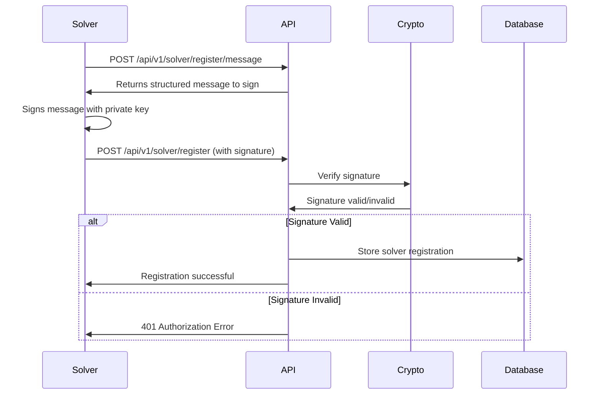

# Solver Authentication & Signature Verification

This document explains how solver authentication works in the Orbital Intents AMM, including the signature verification process for solver registration.

## Overview

Solver registration requires cryptographic signature verification to ensure that only the legitimate owner of an Ethereum address can register as a solver. This prevents unauthorized registrations and maintains the security of the solver ecosystem.

## Authentication Flow

### 1. Solver Registration Process



### 2. Message Structure

The registration message follows a specific format to ensure consistency and security:

```text
Orbital Intents Solver Registration
Solver Address: 0x1234...5678
Bond Amount: 1000000000000000000 wei
Supported Chains: [1,137,42161]
Fee Rate: 30 bps

By signing this message, I confirm that:
- I am the owner of the solver address
- I agree to the solver terms and conditions
- I understand that my bond may be slashed for misbehavior
```

## API Endpoints

### Get Registration Message

**Endpoint:** `POST /api/v1/solver/register/message`

**Description:** Returns the structured message that needs to be signed for registration.

**Request Body:**
```json
{
  "solver_address": "0x1234567890123456789012345678901234567890",
  "bond_amount": "1000000000000000000",
  "supported_chains": [1, 137, 42161],
  "fee_rate": 30.0
}
```

**Response:**
```json
{
  "message": "Orbital Intents Solver Registration\nSolver Address: 0x1234...5678\n...",
  "solver_address": "0x1234567890123456789012345678901234567890",
  "bond_amount": "1000000000000000000",
  "supported_chains": [1, 137, 42161],
  "fee_rate": 30.0
}
```

### Register Solver

**Endpoint:** `POST /api/v1/solver/register`

**Description:** Registers a new solver with signature verification.

**Request Body:**
```json
{
  "solver_address": "0x1234567890123456789012345678901234567890",
  "bond_amount": "1000000000000000000",
  "supported_chains": [1, 137, 42161],
  "fee_rate": 30.0,
  "contact_info": "solver@example.com",
  "signature": "0x1b2c3d4e5f6a7b8c9d0e1f2a3b4c5d6e7f8a9b0c1d2e3f4a5b6c7d8e9f0a1b2c3d4e5f6a7b8c9d0e1f2a3b4c5d6e7f8a9b0c1d2e3f4a5b6c7d8e9f0a1b2c"
}
```

**Success Response (201):**
```json
{
  "address": "0x1234567890123456789012345678901234567890",
  "bond_amount": "1000000000000000000",
  "supported_chains": [1, 137, 42161],
  "reputation_score": 0.0,
  "success_count": 0,
  "failure_count": 0,
  "total_volume": "0",
  "fee_rate": 30.0,
  "is_active": true,
  "is_slashed": false
}
```

**Error Responses:**
- `400 Bad Request` - Invalid request format or validation errors
- `401 Unauthorized` - Invalid signature
- `409 Conflict` - Solver already registered

## Signature Verification Process

### 1. Message Creation

The message is created using the `create_solver_registration_message` function:

```rust
pub fn create_solver_registration_message(
    solver_address: Address,
    bond_amount: &U256,
    supported_chains: &[u64],
    fee_rate: f64,
) -> Vec<u8>
```

### 2. Signature Verification

The signature is verified using the `verify_signature` function:

```rust
pub fn verify_signature(
    message: &[u8],
    signature: &str,
    expected_signer: Address,
) -> Result<bool>
```

This function:
1. Parses the signature from hex string
2. Hashes the message using EIP-191 personal sign format
3. Recovers the signer address from the signature
4. Compares with the expected signer address

### 3. Security Considerations

- **EIP-191 Compliance:** Uses Ethereum's personal message signing standard
- **Address Recovery:** Cryptographically recovers the signer address
- **Tamper Protection:** Any modification to the message invalidates the signature
- **Replay Protection:** Each registration includes unique bond amount and parameters

## Implementation Details

### Crypto Module

The `crypto.rs` module provides:

```rust
// Core verification function
pub fn verify_signature(message: &[u8], signature: &str, expected_signer: Address) -> Result<bool>

// Message creation
pub fn create_solver_registration_message(/* params */) -> Vec<u8>

// EIP-712 support (future enhancement)
pub fn verify_typed_data_signature<T: Encode>(/* params */) -> Result<bool>
```

### Error Handling

Signature verification errors are handled gracefully:

```rust
// Invalid signature format
ApiError::Validation("Invalid signature format: ...")

// Failed signature recovery
ApiError::Validation("Failed to recover signer: ...")

// Authorization failure
ApiError::Authorization("Invalid signature for solver registration")
```

## Testing

### Unit Tests

The implementation includes comprehensive tests:

```rust
#[tokio::test]
async fn test_solver_registration_signature() {
    // Test valid signature verification
}

#[tokio::test]
async fn test_invalid_signature() {
    // Test invalid signature rejection
}

#[test]
fn test_registration_message_format() {
    // Test message format consistency
}
```

### Integration Tests

Test the complete registration flow:

1. Generate registration message
2. Sign with wallet
3. Submit registration request
4. Verify successful registration

## Tools and Utilities

### JavaScript Signature Generator

Use the provided script to generate registration signatures:

```bash
node backend/scripts/generate_solver_signature.js
```

This interactive script:
1. Prompts for solver private key
2. Collects registration parameters
3. Creates the structured message
4. Generates the signature
5. Outputs the complete registration request JSON

### Example Usage

```bash
$ node backend/scripts/generate_solver_signature.js

=== Orbital Intents Solver Registration Signature Generator ===

Enter your solver private key (will not be displayed): 
Solver Address: 0x1234567890123456789012345678901234567890
Enter bond amount in ETH: 1.0
Enter supported chain IDs (comma-separated, e.g., 1,137,42161): 1,137
Enter fee rate in basis points (e.g., 30 for 0.3%): 25

--- Message to Sign ---
Orbital Intents Solver Registration
Solver Address: 0x1234567890123456789012345678901234567890
Bond Amount: 1000000000000000000 wei
Supported Chains: [1,137]
Fee Rate: 25 bps

By signing this message, I confirm that:
- I am the owner of the solver address
- I agree to the solver terms and conditions
- I understand that my bond may be slashed for misbehavior
--- End Message ---

=== Registration Request JSON ===
{
  "solver_address": "0x1234567890123456789012345678901234567890",
  "bond_amount": "1000000000000000000",
  "supported_chains": [1, 137],
  "fee_rate": 25,
  "signature": "0x..."
}
```

## Security Best Practices

### For Solvers

1. **Private Key Security:** Never share your private key
2. **Verify Message Content:** Always verify the message content before signing
3. **Use Hardware Wallets:** Consider using hardware wallets for production
4. **Environment Isolation:** Run the signature generator in a secure environment

### For Developers

1. **Signature Validation:** Always validate signatures server-side
2. **Message Consistency:** Use consistent message formatting
3. **Error Handling:** Provide clear error messages for signature failures
4. **Rate Limiting:** Implement rate limiting on registration endpoints

## Future Enhancements

### EIP-712 Typed Data Signatures

Future versions may support EIP-712 for structured data signing:

```typescript
const domain = {
  name: 'Orbital Intents',
  version: '1',
  chainId: 1,
  verifyingContract: '0x...'
};

const types = {
  SolverRegistration: [
    { name: 'solverAddress', type: 'address' },
    { name: 'bondAmount', type: 'uint256' },
    { name: 'supportedChains', type: 'uint256[]' },
    { name: 'feeRate', type: 'uint256' },
    { name: 'nonce', type: 'uint256' },
    { name: 'deadline', type: 'uint256' }
  ]
};
```

### Multi-Signature Support

Support for multi-signature solver registrations for organizational solvers.

### Hardware Wallet Integration

Direct integration with popular hardware wallets for enhanced security.