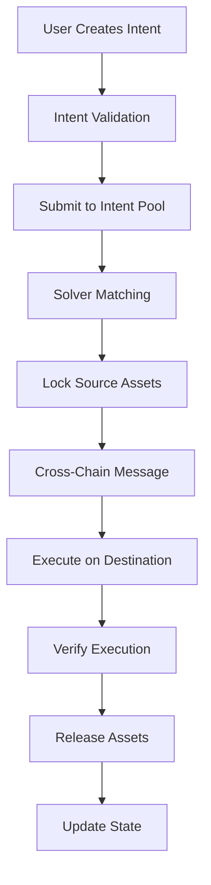

# Cross-Chain Intents System Architecture

## Overview
A production-grade cross-chain intents-based system integrating Orbital AMM technology, built with Rust and Arbitrum Stylus.

## Core Components

### 1. Intent Engine
- **Purpose**: Core orchestration layer for intent processing
- **Components**:
  - Intent Parser & Validator
  - State Manager
  - Execution Coordinator
  - Event Emitter

### 2. Orbital AMM
Based on Paradigm's research, the Orbital AMM provides:
- **Virtual Liquidity**: Pools exist across multiple chains simultaneously
- **Dynamic Pricing**: Adjusts based on cross-chain arbitrage opportunities
- **Capital Efficiency**: Shared liquidity reduces fragmentation
- **MEV Protection**: Time-weighted price oracles and commit-reveal schemes

### 3. Solver Network
- **Decentralized Matching**: Multiple solvers compete to fulfill intents
- **Reputation System**: Track solver performance and reliability
- **Slashing Mechanism**: Penalize malicious behavior
- **Incentive Alignment**: Rewards for efficient execution

### 4. Cross-Chain Infrastructure
- **Message Passing**: Reliable cross-chain communication
- **State Synchronization**: Consistent state across chains
- **Proof Verification**: Cryptographic validation of executions
- **Bridge Abstraction**: Unified interface for multiple bridges

## System Flow



## Security Model

### Multi-Layer Security
1. **Intent Verification**: Cryptographic signatures and validity checks
2. **Solver Bonds**: Economic security through staking
3. **Time Locks**: Protection against front-running
4. **Emergency Pause**: Circuit breakers for anomaly detection

### Trust Assumptions
- Honest majority of solvers
- Bridge security guarantees
- Chain finality assumptions
- Oracle reliability

## Orbital AMM Design

### Virtual Pools
```
Pool State = {
    reserve0: physical + virtual,
    reserve1: physical + virtual,
    k: constant product invariant,
    fee: dynamic fee model
}
```

### Price Discovery
- Cross-chain arbitrage drives price convergence
- Time-weighted average prices (TWAP) for oracle resistance
- Dynamic fees based on volatility and volume

### Liquidity Aggregation
- Single LP token represents positions across chains
- Automatic rebalancing based on demand
- Yield optimization through fee compounding

## Intent Lifecycle

### 1. Creation
- User specifies source/destination chains and tokens
- Sets minimum output amount and deadline
- Signs intent with EIP-712

### 2. Discovery
- Intent broadcast to solver network
- Solvers evaluate profitability
- Best solver wins right to execute

### 3. Execution
- Solver locks user funds on source chain
- Executes swap through optimal path
- Delivers assets on destination chain

### 4. Settlement
- Cryptographic proof of execution
- State updates across all chains
- Fee distribution to solver and protocol

## Technology Stack

### Smart Contracts (Arbitrum Stylus)
- Rust-based contracts for EVM chains
- Gas-efficient execution
- Type-safe development

### Backend Services
- **API Layer**: RESTful + WebSocket APIs
- **Indexer**: Real-time chain state tracking
- **Solver Engine**: Optimization algorithms
- **Bridge Monitor**: Cross-chain event tracking

### Frontend
- React-based responsive UI
- Web3 wallet integration
- Real-time intent tracking
- Analytics dashboard

## Performance Optimizations

### Batching
- Multiple intents processed together
- Reduced gas costs
- Improved capital efficiency

### Caching
- Recent price data
- Bridge state
- Solver reputation scores

### Parallel Processing
- Concurrent chain monitoring
- Async intent matching
- Distributed solver network

## Deployment Architecture

### Infrastructure
- Kubernetes orchestration
- Multi-region deployment
- Redis for caching
- PostgreSQL for persistent storage

### Monitoring
- Prometheus metrics
- Grafana dashboards
- Alert management
- Performance tracking

## Future Enhancements
1. Zero-knowledge proof integration
2. Additional chain support
3. Advanced routing algorithms
4. Governance token and DAO
5. Insurance fund mechanism